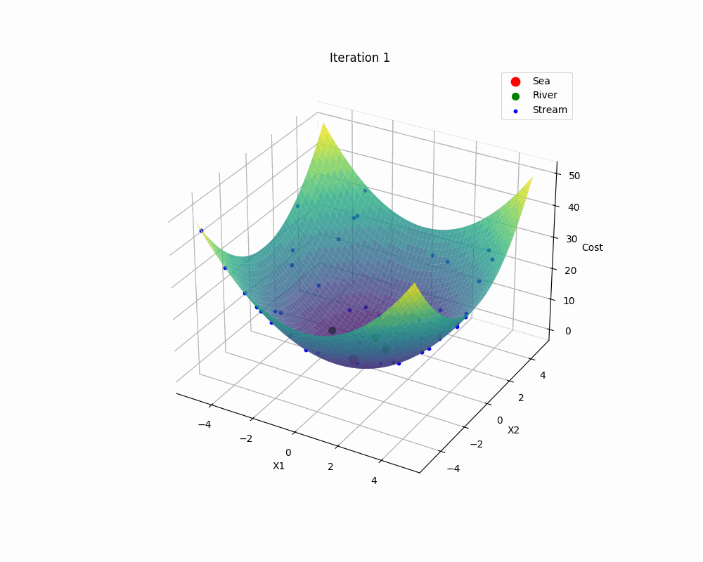

# Nature-inspired Metaheuristics

- Just a playground repo for nature inspired metaheuristics

> [!WARNING]
> This software is unfinished.

## Idea

- Write a simple program to run and visualize some of nature inspired algorithms in 3D.

## Quick start

```console
$ python main.py -run -fname sphere_func -alg WCA
$ python main.py --visualize --function_name sphere_func
$ python main.py --visualize --function_name sphere_func -alg WCA -gif
$ python main.py --visualize --function_name sphere_func -alg WCA -rt
```

## Demo

- You can generate .gif file using -gif arg

```console
$ python main.py --visualize --function_name spehere_func -alg WCA -gif
```




- Feel free to add more benchmark functions and algorithms

## References

- https://www.sciencedirect.com/science/article/pii/S2352711016300024